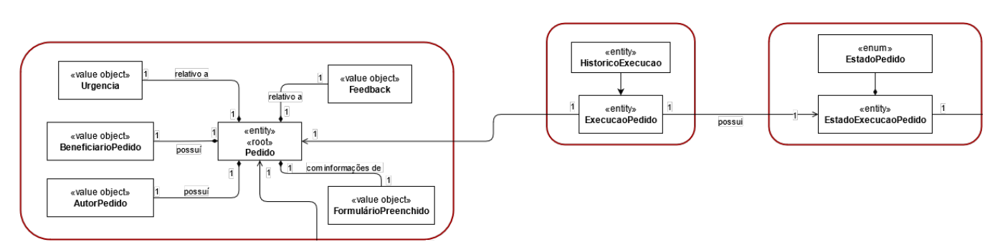
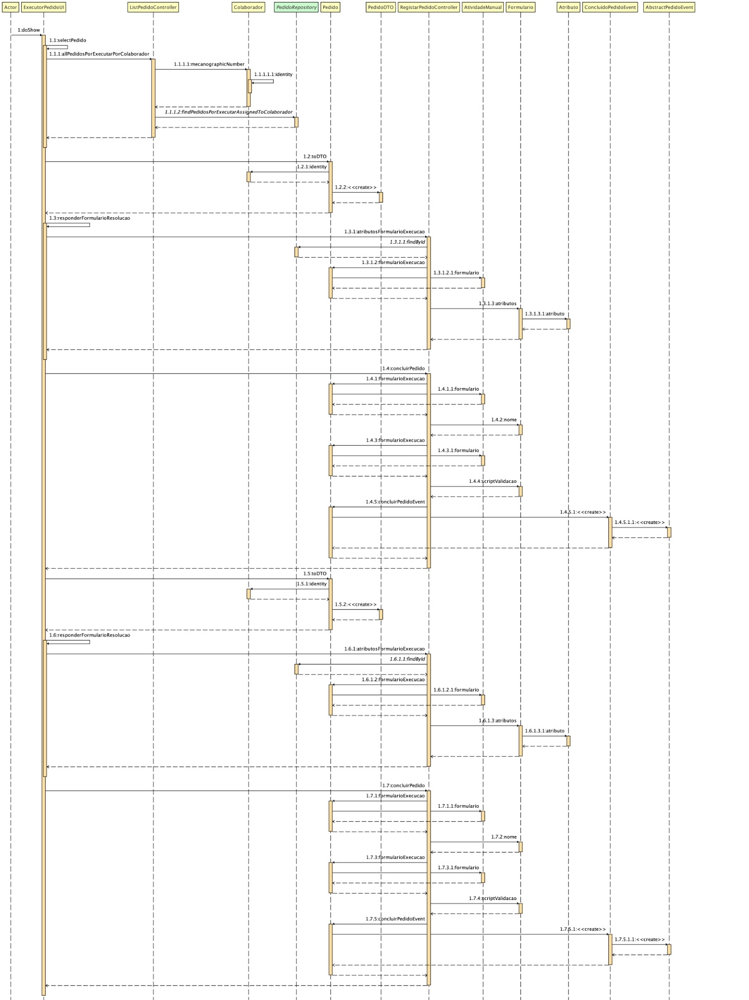

# US3023 Realizar uma tarefa pendente.
=======================================


# 1. Requisitos

- US3023  (issue41) - Como utilizador, eu pretendo realizar uma tarefa que tenho como pendente.

O que nos retirados do caderno de encargo foi que a realização, pode ser opcional e prévia, de uma atividade/tarefa que visa determinar a aprovação/rejeição
do pedido com vista à sua posterior satisfação.
Ou seja uma atividade de aprovacao manual pode ser asignada ao responsavel do criador do pedido e a sua aprovacao vai avancar no estado do pedido.
O seu cancelamento implica o cancelamento do pedido.
Esta issue tem algumas dependencias, pois so conseguimos aprovar pedidos apos a atribuicao destes isues esteja concluida.

## 1.1 Regras de Negócio

* Um Pedido dispoe de uma atividade manual de aprovacao.
* So posso aprovar pedidos que estao assignados a mim.
* A assignação dos pedidos de aprovacao implica que eu sou supervisor do beneficiario do pedido
* Os Pedidos so podem ser aprovados se estiverem em estado assignado
* Os Pedidos so podem ser reprovados se estiverem em estado assignado
* Os Pedidos ao serem aprovados vão para o estado aprovado
* Os Pedidos ao serem recusados vão para o estado recusado

# 2. Análise

# 2.1 Modelo de Domínio



# 3. Design

## 3.1. Realização da Funcionalidade



## 3.3. Padrões Aplicados


|  **Padrão**  | **Observações**		                    |
|--------------|----------------------------------------------------|
| Factory      | Padrão utilizado para atribuir a responsabilidade de criar objetos a uma classe particular. |
| Repository   | Padrão utilizado para persistir os objetos criados.|
| MVC          | Padrão utilizado para a UI e Controllers. 	    |
| Domain Event  | Padrão utilziado para implementação de eventos. |

# 4. Implementação

```
public class AbstractPedidoEvent extends DomainEventBase implements DomainEvent {
    private static final long serialVersionUID = 1L;

    @Id
    @GeneratedValue
    private Long pk;

    @ManyToOne
    private final Pedido pedido;


    @Temporal(TemporalType.TIMESTAMP)
    private Calendar createdOn;

    protected AbstractPedidoEvent() {
        // for ORM
        this.pedido = null;
        this.createdOn = Calendars.now();
    }

    public AbstractPedidoEvent(final Pedido what) {
        this.pedido = what;
        this.createdOn = Calendars.now();
    }

    public Pedido what() {
        return this.pedido;
    }

    public Calendar when() {
        return this.createdOn;
    }


}
```

# 5. Integração/Demonstração

*Nesta secção a equipa deve descrever os esforços realizados no sentido de integrar a funcionalidade desenvolvida com as restantes funcionalidades do sistema.*

# 6. Observações

Nada assinalar.